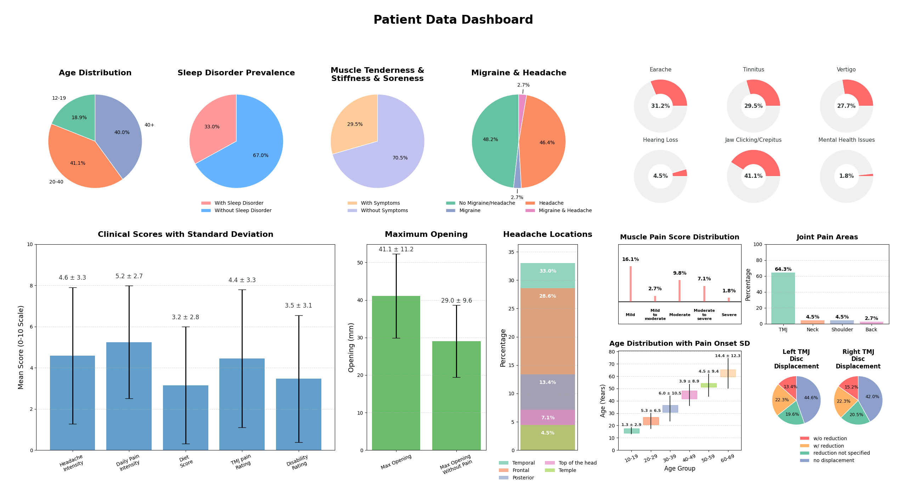

# MedEx: Pilot Extraction of TMD Comorbidities from Clinical Notes Using Large Language Models

Category: Infrastructure

## Key investigators:
- Alban Gaydamour (University of Michigan, USA)

- [Add collaborator name] ([Add affiliation], [Add country])
---

# Project Description

<!-- Add a short paragraph describing the project. -->

Temporomandibular Disorders (TMDs) are often linked with complex comorbidities that are difficult to extract from long free-text clinical notes. This project leverages Large Language Models (LLMs) to identify and summarize these comorbidities, enabling structured analysis and visualization across patient cohorts.

## Objective

<!-- Describe here WHAT you would like to achieve (what you will have as end result). -->

1. Fine-tune open-source LLMs to extract a curated list of TMD-related comorbidities from clinical notes.
2. Generate structured patient-level outputs from model predictions.
3. Visualize comorbidity data using an interactive dashboard.
4. Compare model performance to determine the most clinically effective approach.

## Approach and Plan

<!-- Describe here HOW you would like to achieve the objectives stated above. -->

1. Annotate clinical notes with summaries across 56 comorbidity criteria.
2. Fine-tune LLMs such as `facebook/bart-large-cnn` using chunked note inputs.
3. Generate structured outputs and compile them into a CSV.
4. Visualize cohort-level trends using a Python-based dashboard.
5. Evaluate model performance and deploy the tool to be accessible in 3D Slicer.

## Progress and Next Steps

<!-- Update this section as you make progress, describing of what you have ACTUALLY DONE.
     If there are specific steps that you could not complete then you can describe them here, too. -->

1. Deidentified clinical notes were obtained and manually summarized for 112 patients; a total of 500 are planned.
2. Fine-tuned `facebook/bart-large-cnn` on these summaries to generate structured outputs across 56 comorbidity fields.
3. Generated CSV outputs from model summaries and created a dashboard to visualize cohort-level patterns.
4. Currently working on fine-tuning larger models and expanding the dataset.
5. Next steps include completing 500 patient summaries, comparing model performance, and deploying the tool for use in 3D Slicer.

# Illustrations

<!-- Add pictures and links to videos that demonstrate what has been accomplished.

-->

# Background and References

<!-- If you developed any software, include link to the source code repository.
     If possible, also add links to sample data, and to any relevant publications. -->

- Github Page: https://github.com/DCBIA-OrthoLab/MedEx
- Mike Lewis, Yinhan Liu, Naman Goyal, Marjan Ghazvininejad, Abdelrahman Mohamed, Omer Levy, Veselin Stoyanov, and Luke Zettlemoyer. 2020. BART: Denoising Sequence-to-Sequence Pre-training for Natural Language Generation, Translation, and Comprehension. In Proceedings of the 58th Annual Meeting of the Association for Computational Linguistics, pages 7871–7880, Online. Association for Computational Linguistics.
