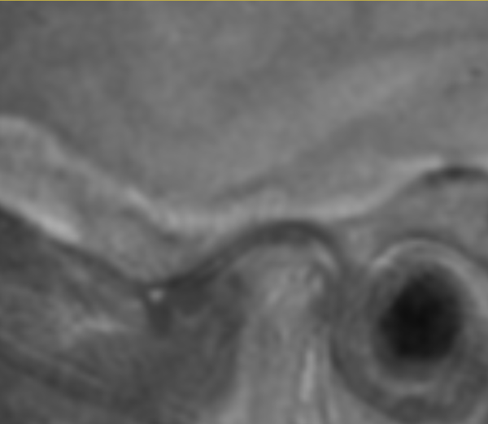

# Automated CBCT-MRI Registration Advances Temporomandibular Degenerative Joint Disease Diagnosis

Category: Infrastructure

## Key investigators:
- Alban Gaydamour (University of Michigan, USA)

- [Add collaborator name] ([Add affiliation], [Add country])

# Project Description

<!-- Add a short paragraph describing the project. -->

Accurate registration between CBCT and MRI scans offers complementary visualization of osseous and soft tissue structures around the temporomandibular joint (TMJ). This project aims to automate the registration process to support more effective diagnosis of temporomandibular degenerative joint disease.

## Objective

<!-- Describe here WHAT you would like to achieve (what you will have as end result). -->

1. Develop a robust multi-step registration pipeline to align MRI and CBCT images in the TMJ region.
2. Enhance diagnostic accuracy by integrating soft tissue and osseous imaging modalities.
3. Move toward a fully automated workflow that eliminates manual intervention.

## Approach and Plan

<!-- Describe here HOW you would like to achieve the objectives stated above. -->

1. Perform initial coarse alignment using TorchReg to approximate global positioning of the volumes.
2. Manually crop both CBCT and MRI volumes to isolate the TMJ region of interest.
3. Apply Elastix-based deformable registration to the cropped images for fine alignment.
4. Evaluate registration quality through both visual assessment and quantitative metrics.
5. Plan to implement automated TMJ region localization to eliminate manual cropping.

## Progress and Next Steps

<!-- Update this section as you make progress, describing of what you have ACTUALLY DONE.
     If there are specific steps that you could not complete then you can describe them here, too. -->

1. Implemented automated global registration using TorchReg.
2. Established a manual cropping protocol focused on the TMJ region to reduce failure modes in deformable registration.
3. Completed fine registration using Elastix on cropped image pairs.
4. Next steps include developing an automated cropping algorithm to complete the end-to-end workflow, and extending the pipeline to handle full-face scans.

# Illustrations

<!-- Add pictures and links to videos that demonstrate what has been accomplished.

-->
### **Figure 1:** Input MRI (grey) and CBCT (beige)

### **Figure 2:** Patient after first registration

### **Figure 3:** Cropping of the left TMJ

### **Figure 4:** Patient after second registration

# Background and References

<!-- If you developed any software, include link to the source code repository.
     If possible, also add links to sample data, and to any relevant publications. -->

- TorchReg: https://github.com/codingfisch/torchreg
- Elastix: https://github.com/SuperElastix/elastix
- Github: https://github.com/DCBIA-OrthoLab/SlicerAutomatedDentalTools
